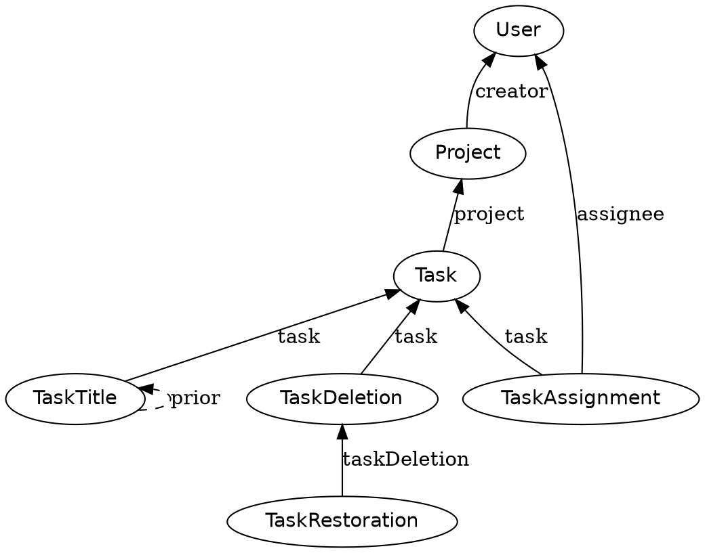
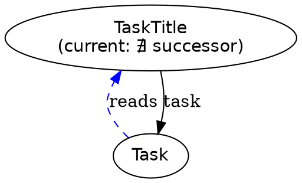
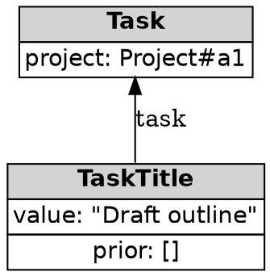

# Diagramming historical models

A fact-type graph is small enough to hold in your head only up to a point.
Drawing it — before or after writing the code — surfaces missing
predecessors, accidental cycles, and mutable properties that never got a
"current value" filter written for them. This skill produces Graphviz `dot`
source; render it with `dot -Tsvg` (or any Graphviz-compatible viewer) to
check it before sharing.

## Fact-type graph

Each fact type is a node; each predecessor relationship is an edge pointing
from the fact *up* to the predecessor it depends on (the direction a fact
"points back in time", not the direction data flows in a query):

Conventions:

- **Ellipses** for fact types. No other shape is needed at this level.
- **Edges point from a fact to its predecessor**, matching the direction a
  `prior` or role reference actually points — never the direction a UI would
  read the data.
- **A self-loop with a dashed edge** (`TaskTitle -> TaskTitle`) marks a
  mutable-property pattern — the fact type that stands in for a value that
  changes over time. Spotting this shape at a glance is the point: if a
  self-loop is missing where you'd expect one, the property is probably
  still (wrongly) a mutable field.
- **Cardinality**, when it matters, goes on the edge label as a suffix:
  `assignee *` for "a task can have many assignments over time",
  `creator` alone for exactly one. Don't annotate obvious single-predecessor
  edges.

## Specification overlay

To show what a specification reads, overlay it on the same graph with dashed
edges for the walk and existential markers for filters:

Use `∃` in a node label for "at least one must exist" and `∄` for "must not
exist" (the current-value / not-deleted filter). Writing the symbol directly
into the label of the fact type being filtered — as above — keeps the
existential attached to the thing it constrains, rather than floating in a
caption.

## Fact instance graph

To show actual data rather than the shape of the type graph, use a
borderless HTML table per fact so field values are visible alongside the
identity:

Reserve this form for walking through a specific example with someone — it's
too dense to use as the primary diagram for an entire model.

## When to reach for this

Diagram a model when it's non-obvious from the fact-class code alone whether
a mutable-property or delete/restore pattern is complete — the visual makes
a missing existential filter or a missing `prior` self-loop obvious in a way
scanning code often doesn't.
